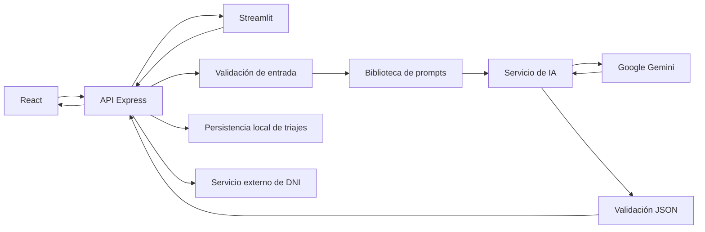

# AVANCE 2 - INTELIGENCIA ARTIFICIAL Y PROMPT ENGINEERING

## 1. Introducción

MediSync es una plataforma de pre-triaje clínico que registra pacientes, evalúa síntomas con Google Gemini y conserva un historial de consultas relevantes. Este avance convierte la integración inicial en un módulo de IA mantenible, demostrable y verificable.

## 2. Problema

El personal de admisión necesita priorizar consultas con rapidez y consistencia. Una descripción libre de síntomas puede ser ambigua, por lo que se requiere estructurar la interacción con el modelo y validar su respuesta antes de usarla en el sistema.

## 3. Objetivo

Integrar un LLM mediante API, aplicar Zero-Shot, One-Shot y Few-Shot, centralizar los prompts, ofrecer interfaces funcionales y proteger claves y datos personales.

| Definición | Descripción |
| --- | --- |
| Problema | Priorización manual y poco consistente de consultas descritas en lenguaje libre. |
| Usuario | Personal administrativo o asistencial que realiza el pre-triaje. |
| Entrada | Descripción de síntomas y técnica de prompting. |
| Procesamiento | Validación, construcción del prompt, consulta al LLM y validación del JSON. |
| Salida | Urgencia, especialidad sugerida y recomendación. |
| Beneficio | Acelera una primera priorización sin sustituir el criterio clínico. |
| Integración | React y Streamlit consumen el mismo endpoint del backend Express. |

## 4. Funcionalidad

El usuario describe síntomas y elige una técnica en Streamlit, o usa el flujo Few-Shot predeterminado en React. El backend valida la entrada, construye el prompt, consulta Gemini, valida el JSON y devuelve urgencia, especialidad y recomendación. En la aplicación principal, solo los triajes distintos de NULA se guardan automáticamente.

## 5. Arquitectura

## 6. Tecnologías

- React, TypeScript, Vite y Tailwind CSS para la aplicación principal.
- Node.js, Express y TypeScript para la API.
- SDK de Google Generative AI para Gemini.
- Streamlit y Requests para la interfaz demostrativa.
- Node Test Runner para pruebas unitarias.
- Docker Compose para ejecutar los tres servicios.
- GitHub Actions para verificación continua.

## 7. Integración con la API

`POST /api/triaje` recibe `sintomas` y opcionalmente `tecnica`. El valor permitido es `zero-shot`, `one-shot` o `few-shot`; si se omite, se utiliza Few-Shot. La clave se lee exclusivamente desde `GEMINI_API_KEY` en el entorno del backend. El modelo y el tiempo máximo son configurables mediante `GEMINI_MODEL` y `AI_TIMEOUT_MS`.

La respuesta válida contiene `urgencia`, `especialidad`, `recomendacion`, `tecnica` y `promptId`. La API rechaza entradas vacías, mayores de 3000 caracteres, técnicas desconocidas y respuestas que no respeten el esquema.

## 8. Ingeniería de prompts

Todos los prompts definen rol, contexto, objetivo, restricciones, formato JSON y datos delimitados. La transcripción completa y versionada se encuentra en [PROMPT_LIBRARY.md](./PROMPT_LIBRARY.md).

### 8.1 Zero-Shot

No contiene ejemplos. Sirve como línea base para observar el efecto de instrucciones estructuradas.

### 8.2 One-Shot

Contiene exactamente un ejemplo de urgencia alta. Enseña formato y nivel de detalle.

### 8.3 Few-Shot

Contiene tres ejemplos contrastantes: urgencia alta, baja y nula. Es la técnica predeterminada porque delimita mejor las categorías y contempla entradas sin relevancia clínica.

## 9. Tabla de prompts

| ID | Técnica | Variables | Resultado esperado |
| --- | --- | --- | --- |
| PROMPT-01 | Zero-Shot | síntomas | JSON clínico válido |
| PROMPT-02 | One-Shot | síntomas | JSON consistente con un ejemplo |
| PROMPT-03 | Few-Shot | síntomas | JSON con clasificación estabilizada |

## 10. Seguridad

- Las claves se almacenan en variables de entorno y `.env` está ignorado por Git.
- `.env.example` documenta nombres sin incluir secretos.
- La comprobación de estado de Gemini envía la clave en un encabezado, no en la URL.
- Los errores del proveedor se traducen a mensajes controlados.
- Los prompts delimitan la entrada para reducir confusión entre datos e instrucciones.
- `backend/data/*.json` se excluye del versionado para evitar publicar datos personales.
- En producción se requieren autenticación robusta, cifrado y una base de datos con control de acceso.

## 11. Manejo de errores

El servicio distingue configuración ausente, entrada inválida, tiempo agotado, cuota, autenticación, conexión y respuesta inválida. La interfaz muestra mensajes comprensibles y nunca recibe el texto interno completo del proveedor.

## 12. Pruebas realizadas

| Prueba | Resultado ejecutado |
| --- | --- |
| Entrada normal | Aprobada mediante prueba unitaria. |
| Entrada vacía | Aprobada; se rechaza con error de entrada. |
| Entrada extensa | Aprobada; se rechazan más de 3000 caracteres. |
| Error de API | Aprobada mediante simulación de cuota y clave ausente. |
| Zero-Shot | Aprobada; cero ejemplos y estructura validada. |
| One-Shot | Aprobada; exactamente un ejemplo. |
| Few-Shot | Aprobada; tres ejemplos y categorías ALTA/NULA. |
| Respuesta inesperada | Aprobada con respuesta vacía y urgencia desconocida. |
| Reinicio de aplicación | Aprobada; backend compilado reiniciado y tres prompts recuperados por HTTP. |
| Entorno limpio | Frontend reinstalado con lockfile congelado y compilado correctamente. |
| Integración real con Gemini | Aprobada para Zero-Shot, One-Shot y Few-Shot; el caso sin malestar devolvió NULA. |
| Interacción Streamlit | Aprobada con `AppTest`: cero errores y dos métricas renderizadas. |

En total se ejecutaron 13 pruebas unitarias, todas aprobadas. También se verificaron tipos y compilación del backend, compilación de producción del frontend, lint, el arranque HTTP de Streamlit y una interacción real con Gemini. Docker no pudo ejecutarse en el equipo de verificación porque el comando no está instalado.

## 13. Resultados

La lógica de IA quedó desacoplada de las rutas HTTP, la biblioteca puede ampliarse sin duplicar integración y ambas interfaces consumen la misma API. Few-Shot queda seleccionado para operación normal y las otras técnicas permanecen disponibles para demostración académica.

## 14. Evidencias y capturas

Para la entrega se deben capturar, sin mostrar claves ni datos reales:

1. React ejecutándose en `/triaje` y mostrando un resultado.
2. Streamlit en `http://localhost:8501` con cada técnica seleccionada.
3. Resultado de `pnpm test` con todas las pruebas aprobadas.
4. Ejecución de `docker compose up --build` con los tres servicios activos.
5. GitHub Actions aprobado en el pull request.

## 15. Limitaciones

El sistema no diagnostica, depende de disponibilidad y cuota de Gemini, y la salida puede variar entre ejecuciones. La persistencia JSON es solo para demostración. El servicio de DNI es externo y puede cambiar su HTML o sus controles de acceso.

## 16. Conclusiones

El avance implementa un caso de IA alineado con el problema, tres técnicas verificables, una biblioteca documentada, manejo seguro de configuración y dos interfaces funcionales. La validación posterior al LLM evita confiar ciegamente en texto libre.

## Matriz de cumplimiento final

| Criterio | Estado | Evidencia |
| --- | --- | --- |
| LLM integrado por API | Cumple | `backend/src/ai/aiService.ts` |
| Zero-Shot real | Cumple | PROMPT-01, sin ejemplos |
| One-Shot real | Cumple | PROMPT-02, un ejemplo |
| Few-Shot real | Cumple | PROMPT-03, tres ejemplos |
| Biblioteca documentada | Cumple | `docs/PROMPT_LIBRARY.md` |
| Interfaz principal | Cumple | React `/triaje` |
| Interfaz demostrativa | Cumple | `streamlit/app.py` |
| Seguridad de secretos | Cumple para desarrollo | `.env.example` y exclusiones Git |
| Pruebas automatizadas | Cumple | 12 pruebas unitarias |
| Contenedores | Cumple en configuración | Dockerfiles y `docker-compose.yml` |

## Matriz antes y después

| Requisito | Antes | Después | Evidencia |
| --- | --- | --- | --- |
| LLM integrado mediante API | Cumple | Cumple | Servicio Gemini reutilizado y aislado |
| Funcionalidad relacionada con el negocio | Cumple | Cumple | Clasificación de pre-triaje |
| Streamlit funcional | No cumple | Cumple | `streamlit/app.py` |
| Zero-Shot | No cumple | Cumple | PROMPT-01 |
| One-Shot | No cumple | Cumple | PROMPT-02 |
| Few-Shot | Cumple parcialmente | Cumple | PROMPT-03 implementado y probado |
| Prompts estructurados y delimitados | Cumple parcialmente | Cumple | `promptLibrary.ts` |
| Biblioteca y justificación | No cumple | Cumple | `docs/PROMPT_LIBRARY.md` |
| API key protegida | Cumple parcialmente | Cumple en código | Variable de entorno y `.env.example` |
| Manejo de errores | Cumple parcialmente | Cumple | `ErrorIA` y mensajes controlados |
| Pruebas automatizadas | No cumple | Cumple | 13 pruebas aprobadas |
| Documentación del módulo | No cumple | Cumple | Este informe y README |
| Avance 1 preservado | Cumple | Cumple | Frontend compilado y endpoints existentes conservados |
